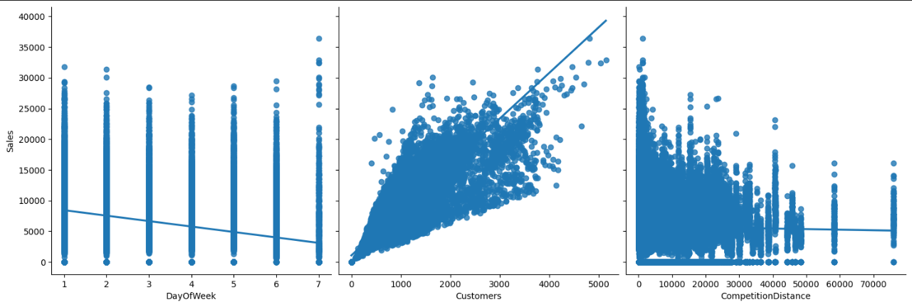

# 1.0 Objetivo do Projeto

O objetivo deste projeto é realizar uma análise estatística de uma base de dados pública para aprimorar habilidades em análise de correlação e influência de variáveis sobre uma variável alvo. Utilizamos uma base de dados de uma competição no Kaggle, cujo objetivo era prever as vendas das próximas 6 semanas de uma rede de drogarias. Adaptamos o problema de negócio para entender quais variáveis influenciavam o aumento ou a queda nas vendas. Abaixo, você encontrará uma visão geral do problema e a solução proposta.

# 2.0 Problema de Negócio

A Rede de Drogarias Rossmann possui 3.000 lojas em 7 países europeus e mais de 30 anos de mercado. Os superintendentes solicitaram aos gerentes planos e ações para melhorar o faturamento das lojas. Recebemos a demanda de entender quais variáveis influenciam positiva ou negativamente o faturamento, a fim de criar planos estratégicos e melhores organizações de times para atingir esse objetivo.

## 2.1 Proposta de Solução

Para resolver o problema de negócio, propomos uma análise de correlação para entender como as variáveis se relacionam com o faturamento das lojas, seguida de uma análise de regressão para compreender o impacto direto dessas variáveis no faturamento.

## 2.2 Entrega Final

A entrega final será um relatório contendo:
- As variáveis que impactam o faturamento;
- Uma análise detalhada sobre essas variáveis;
- Recomendações com base nessa análise.

## 2.3 Base de Dados Principal

Após juntar dados de cadastro das lojas, informações de vendas, promoções e outros detalhes, trabalhamos com a seguinte base de dados, com aproximadamente 1,1 milhão de registros, composta pelas seguintes colunas:

| Coluna                  | Descrição                                                                                                  |
|-------------------------|------------------------------------------------------------------------------------------------------------|
| **Store**               | Identificador único para cada loja                                                                         |
| **Sales**               | Faturamento de qualquer dia específico (isso é o que você está prevendo)                                   |
| **Customers**           | Número de clientes em um dado dia                                                                          |
| **Open**                | Indicador se a loja estava aberta: 0 = fechada, 1 = aberta                                                 |
| **StateHoliday**        | Indica um feriado estadual: a = feriado público, b = Páscoa, c = Natal, 0 = Nenhum                         |
| **SchoolHoliday**       | Indica se a (Loja, Data) foi afetada pelo fechamento das escolas públicas                                  |
| **StoreType**           | Modelos de lojas: a, b, c, d                                                                               |
| **Assortment**          | Nível de sortimento: a = básico, b = extra, c = estendido                                                  |
| **CompetitionDistance** | Distância até a loja concorrente mais próxima                                                              |
| **CompetitionOpenSinceMonth/Year** | Ano e mês aproximados em que a loja concorrente mais próxima foi aberta           |
| **Promo**               | Indica se uma loja está realizando uma promoção nesse dia                                                  |
| **Promo2**              | Promoção contínua: 0 = a loja não está participando, 1 = a loja está participando                         |
| **Promo2SinceYear/Month** | Ano e semana em que a loja começou a participar da Promo2                                |
| **PromoInterval**       | Meses em que a Promo2 é iniciada: "Fev, Mai, Ago, Nov"                                                     |

# 3.0 Análise Exploratória dos Dados

Durante o processo de análise exploratória, realizamos uma análise geral entre nossas variáveis independentes e a variável alvo. Isso permitiu compreender melhor nosso dataset e validar as informações disponíveis. A análise dos gráficos abaixo trouxe conclusões interessantes:

**Relatório**

- **Day of Week**: Durante os primeiros dias da semana, o faturamento é maior. Com a chegada do fim de semana, o volume diminui devido à menor movimentação de pessoas nas drogarias durante sextas, sábados e domingos.
- **Customers**: O aumento do número de clientes nas drogarias resulta em maior faturamento, pois mais pessoas estão realizando compras.
- **CompetitionDistance**: Analisando o gráfico, percebemos uma leve tendência de queda na regressão. Lojas com concorrentes mais próximos tendem a realizar mais promoções, aumentando o volume de vendas. Com um concorrente mais distante, as promoções não são tão frequentes, impactando menos o volume de vendas.
- **Open**: Lojas abertas possuem um maior volume de vendas.
- **Promo**: Lojas em promoção tendem a ter um maior volume de vendas, já que esse é o objetivo da promoção.
- **SchoolHoliday**: Lojas afetadas por feriados escolares têm um faturamento maior, pois estão localizadas próximas a escolas, resultando em maior movimentação de segunda a sábado.
- **Promo2**: Promoções têm efeito apenas por um período limitado. Após os clientes adquirirem os produtos, eles não compram novamente tão rapidamente. Promoções prolongadas perdem força.
- **StateHoliday**: O faturamento é maior em datas que não são feriados.
- **Assortment**: Drogarias com uma variedade básica ou estendida faturam menos que drogarias com uma variedade intermediária. Variedade básica não atende a todas as necessidades, enquanto variedade excessiva inclui produtos de baixa rotatividade, impactando o volume de vendas.
- **StoreType**: Todas as lojas faturam, mas as do tipo b possuem maior faturamento.
- **CompetitionOpenSinceYearMonth**: Não há diferença significativa entre o tempo de abertura de um competidor e as vendas, indicando que as lojas mantêm suas vendas de forma constante.

Após essa análise descritiva dos dados, passamos à engenharia de atributos para entender informações ocultas nos dados.

# 4.0 Engenharia de Atributos

Na engenharia de atributos, criamos novas variáveis para uma análise mais rica e objetiva. As variáveis criadas incluem:

- **WeekOfMonth**: Semana do mês.
- **PublicHoliday**: Indica se é um feriado público (0 - Não, 1 - Sim).
- **EasterHoliday**: Indica se é Páscoa (0 - Não, 1 - Sim).
- **Christmas**: Indica se é Natal (0 - Não, 1 - Sim).
- **Promo2Jan/Fev/Mar/Apr/.../Dec**: Indica se, em determinado dia, a loja estava em promoção.
- **CompetitionYear**: Tempo, em anos, que a loja está em competição com outra loja concorrente próxima.

A construção dessas variáveis permite uma análise mais rica e, possivelmente, a identificação de fatores que impactam no faturamento.

# 5.0 Análise de Correlação

Utilizando os métodos de Pearson e Spearman, identificamos as variáveis que possuem correlação com a variável alvo e são independentes entre si. As variáveis abaixo foram selecionadas para análise das correlações:

- **Promo**: Lojas em promoção atraem mais clientes para compras de medicamentos, itens de higiene e cuidados pessoais. Coeficiente de correlação: 0.43.
- **PublicHoliday**: Feriados públicos impactam negativamente as vendas, com clientes focados em aproveitar o feriado. Coeficiente de correlação: -0.2.
- **DayOfWeek**: Durante a semana, há maior volume de vendas, que diminui no final de semana. Coeficiente de correlação: -0.18.
- **Customers**: Mais clientes na loja resultam em maior faturamento. Coeficiente de correlação de Pearson: 0.79.
- **Assortment**: Lojas com maior variedade de produtos abrangem mais público, aumentando as vendas. Coeficiente de correlação: 0.12.
- **Promo2**: Promoções duradouras perdem força ao longo do tempo, impactando negativamente as vendas. Coeficiente de correlação: -0.10.

# 6.0 Modelagem Estatística

Com as variáveis selecionadas na análise de correlação, aplicamos uma regressão linear utilizando o método dos mínimos quadrados para entender o impacto das variáveis independentes no faturamento. O modelo apresentou um R² de 0.703, satisfazendo 4 dos 5 testes estatísticos:

1. Linearidade dos Dados
2. Normalização dos Erros (falhou)
3. Independência dos Erros
4. Não existência de Multicolinearidade
5. Homocedasticidade da Regressão

A partir do modelo estatístico, obtemos as seguintes análises:

- **Promo**: Coeficiente linear de 559.85, indicando que lojas em promoção tendem a aumentar o faturamento em US$ 559.85, com variação entre 556.31 e 563.39.
- **Promo2**: Coeficiente linear de 126.21, indicando aumento nas vendas de US$ 126.21 quando a Promo2 está ativa, com variação entre 122.81 e 129.61.
- **PublicHoliday**: Impacto negativo de -23.67 nas vendas durante feriados públicos, com variação entre -26.99 e -20.36.
- **DayOfWeek**: Impacto negativo de -49.14 nas vendas ao longo da semana, com variação entre -52.6 e -45.68.
- **Customers**: Aumento de clientes impacta positivamente em 1750.82 o valor das vendas, com variação entre 1747.19 e 1754.33.
- **Assortment**: Maior variedade de produtos aumenta o faturamento em 313.05, com variação entre 309.73 e 316.37.

# Relatório Final - Gestor

**Promo**
Lojas em promoção tendem a aumentar suas vendas em US$ 559.85 diários, com variação entre US$ 556.31 e US$ 563.39.

**Promo2**
Promoções contínuas têm um impacto positivo, mas menor que as promoções diárias. Aumentam as vendas em US$ 126.21 diários, com variação entre US$ 122.81 e US$ 129.61.

**PublicHoliday**
Feriados públicos impactam negativamente as vendas, com uma diminuição de US$ 23.67, variando entre US$ 20.36 e US$ 26.99.

**DayOfWeek**
Vendas diminuem ao longo da semana, com queda de US$ 49.14 por dia, variando entre US$ 45.68 e US$ 52.60.

**Customers**
Aumento de clientes resulta em maior faturamento, com impacto de US$ 1750.82 nas vendas, variando entre US$ 1747.19 e US$ 1754.33.

**Assortment**
Maior variedade de produtos aumenta o faturamento em US$ 313.05, variando entre US$ 309.73 e US$ 316.37.

**Recomendações**
1. Realizar ações de aumento de venda no início da semana, evitando finais de semana.
2. Investir no aumento de estoque das drogarias com variedade básica para aumentar o faturamento diário.
3. Promover ações de promoções pontuais estratégicas, mais efetivas que promoções contínuas.
4. Implementar ações para aumentar a quantidade de clientes.